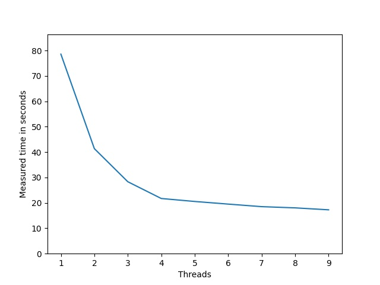

# Lab 2: Integral parallel calculation (Variant-1)

## Team

 - [Maksym Protsyk](https://github.com/maksprotsyk)

## Usage
To build executable 
```bash
mkdir build
cd build
cmake ..
make
```
To run program once
```bash
cd bin
 ./calculator "configuration_file" "output_file"
```

To run program many times for different number of threads and get minimum time for each
```bash
python3 script.py "name for temporary configuration file" "output_file" "number of runs"
```


## Prerequisites

 - C++17
 - CMake 3.15+


## Results


As we can see, for threads from 1 to 4, the
speed multiplies by their amount. For threads from 5 to 9
decrease in time is much smaller.


## Important

Configuration file structure is:
```
min_x max_x min_y max_y absolute_error relative_error threads_num
```
(all separated by spaces)


