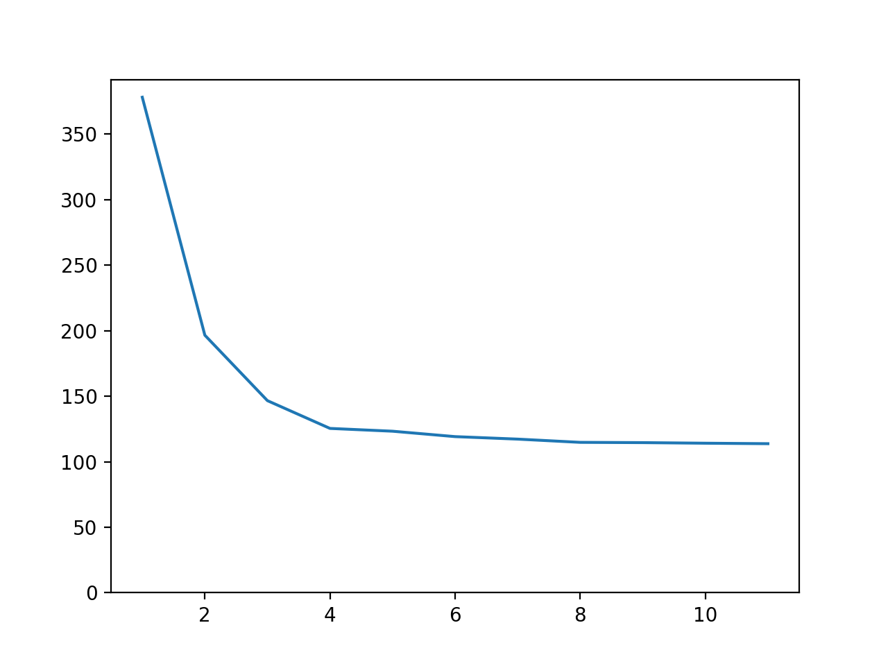

# Lab 3 Part 1: Counting the number of words in text files (Naive approach)

## Team

 - [Maksym Protsyk](https://github.com/maksprotsyk)
 - [Yarema Mishchenko](https://github.com/RavenbornJB)
 - [Maksym Kuzyshyn](https://github.com/maxymkuz)

## Usage
To build executable 
```bash
mkdir build
cd build
cmake ..
make
```
To run program once
```bash
cd bin
 ./prog "configuration_file"
```

To run python script which tests the program on given data with different number of threads
```bash
python3 script.py 'progname' 'number of runs' 'indexing folder' 'max threads num'
```


## Prerequisites

 - C++17
 - CMake 3.15+


## Results
Time taken on indexing of folder 6 of smaller archive


[Google drive with results of indexing for folder 5 of smaller archive](https://drive.google.com/drive/folders/1cD8SDe0Q93aP9Ukm-UsAbz4q1dx_kxaV?usp=sharing)

- Time taken on reading: 19.17s
- Time taken on indexing: 480.57s
- Total time: 505.29s

(Program was tested on computer with Intel core i5 8257u processor (4 physical cores, 1.40GHz base frequency) and 16GB of RAM using 12 threads)


## Important

Configuration file structure is:
```
index_directory_path="path to the directory which needs indexing"
by_alphabet_path="path to the file, where dictionary sorted by the alphabet will be saved"
by_count_path="path to the file, where dictionary sorted by number of occurrences will be saved"
threads="number of threads that will be used for counting words in the collected vector of strings"
```

- If some values are not specified, the default ones will be taken.
- If any parameter is set more than once, then the last its occurrence will be taken.
- Invalid lines are ignored
