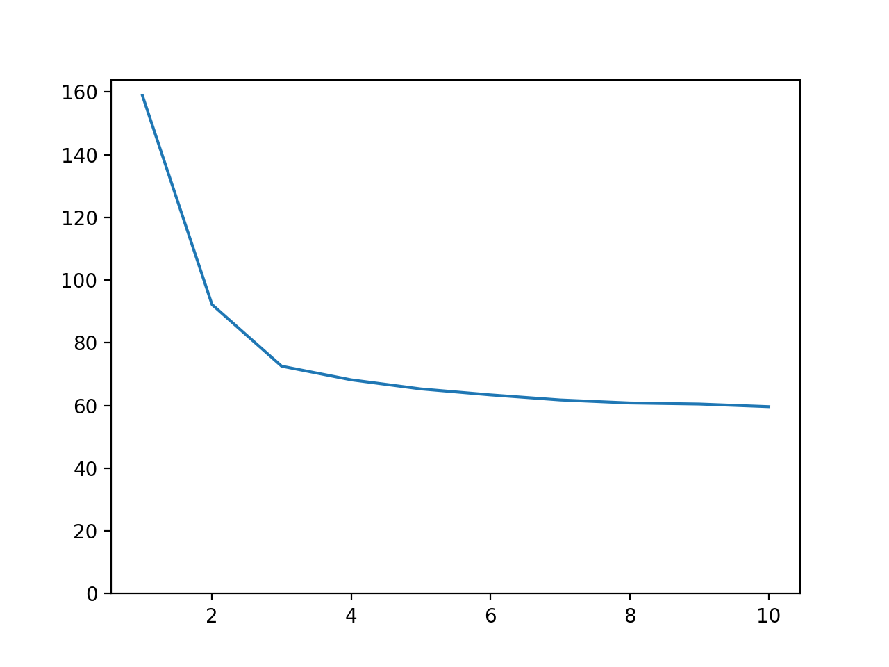

# Lab 3 Part 2: Counting the number of words in text files

## Team

 - [Maksym Protsyk](https://github.com/maksprotsyk)
 - [Yarema Mishchenko](https://github.com/RavenbornJB)
 - [Maksym Kuzyshyn](https://github.com/maxymkuz)

## Usage
To build executable 
```bash
mkdir build
cd build
cmake ..
make
```
To run program once
```bash
cd bin
 ./prog "configuration_file"
```

To run python script which tests the program on given data with different number of 
indexing threads and merging threads (by default we use 2 merging threads)
```bash
python3 script.py 'progname' 'number of runs' 'indexing folder' 'max threads num'
```


## Prerequisites

 - C++17
 - CMake 3.15+


## Results
Time taken on indexing of folders 0, 2, 3 of guttenberg_2020_03_06.iso (224 MB)

(We start with 1 reading thread, 1 indexing thread and 1 merging thread and then increase number of indexing and merging threads by 1)

                                                                 
[Google drive with results of indexing for guttenberg_2020_03_06.iso](https://drive.google.com/drive/u/0/folders/1p6Lr1hVJSEDfSR8jLGBEL42hHsol5hn2)

- Reading thread time: 3949.18s
- Indexing threads time: 4006.66s
- Total time: 4020.08s

(Program was tested on computer with Intel core i5 8257u processor (4 physical cores, 1.40GHz base frequency) and 16GB of RAM using 12 threads
for merging and indexing)


## Important

Configuration file structure is:
```
index_directory_path="path to the directory which needs indexing"
by_alphabet_path="path to the file, where dictionary sorted by the alphabet will be saved"
by_count_path="path to the file, where dictionary sorted by number of occurrences will be saved"
threads_indexing="number of threads that start with indexing (after indexing are used for merging"
threads_merging="number of threads that start with merging"
max_size="maximal possible size of text file in bytes"
index_queue_size="indexing queue maximal size"
merge_queue_size="merging queue maximal size"
```

- If some values are not specified, the default ones will be taken.
- If any parameter is set more than once, then the last its occurrence will be taken.
- Invalid lines are ignored