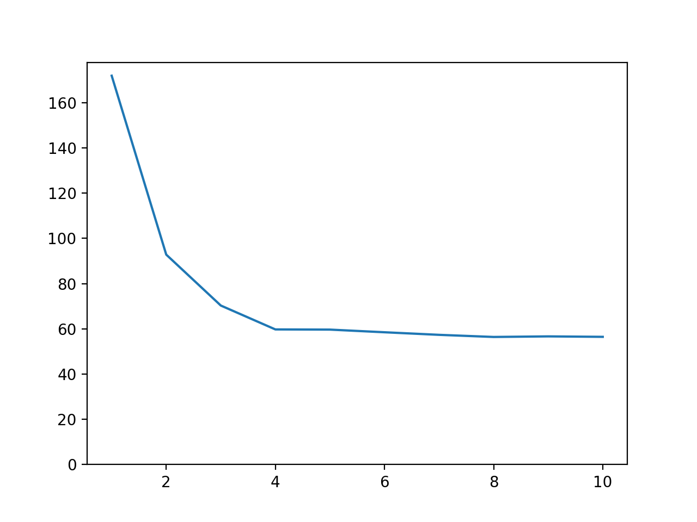
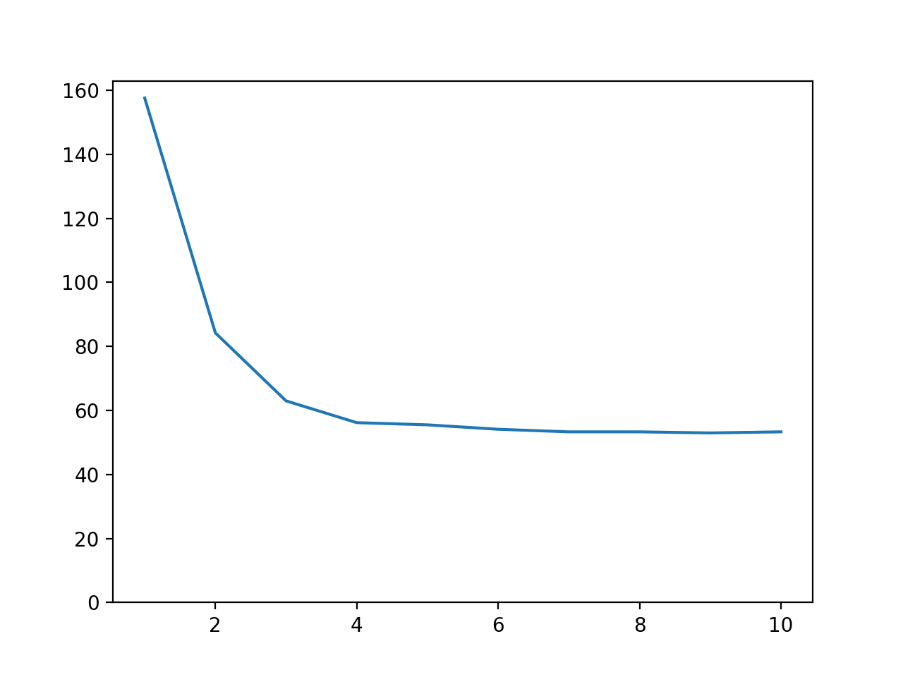

# Lab 3 Part 4: Counting the number of words in text files (high-level thread-safe tools)

## Team

 - [Maksym Protsyk](https://github.com/maksprotsyk)
 - [Yarema Mishchenko](https://github.com/RavenbornJB)
 - [Maksym Kuzyshyn](https://github.com/maxymkuz)

## Usage
To build executable 
```bash
mkdir build
cd build
cmake ..
make
```
To run program once
```bash
cd bin
 ./prog "configuration_file"
```

To run python script which tests the program on given data with different number of 
indexing threads and merging threads (by default we use 2 merging threads)
```bash
python3 script.py 'progname' 'number of runs' 'indexing folder' 'max threads num'
```


## Prerequisites

 - C++17
 - CMake 3.15+


## Results
Time taken on indexing of folders 0, 2, 3 of guttenberg_2020_03_06.iso (224 MB)

(We increase maximal number of tokens in pipeline)

### New plot:
(we used TBB's parallel pipeline)

### Old plot:
(we used TBB's concurrent bounded queue and concurrent hash map, the number on OX represents the amount of indexing and merging threads)

So the new version is a little bit slower (56.4 seconds for 10 tokens in pipeline for new version and 55.4 seconds for 1 reading, 5 merging and 5 indexing threads for old version)

(We used indexing queue of size 250 and merging queue of size 500 in second case)

## Indexuing of Guttenberg library
 The results are the same as in the previous lab:                                                                
[Google drive with results of indexing for guttenberg_2020_03_06.iso](https://drive.google.com/drive/u/0/folders/1p6Lr1hVJSEDfSR8jLGBEL42hHsol5hn2)

- Indexing time: 3578.71s
- Total time: 3602.05s

Time is slightly better, compared to the result of part 3, but here we used 300 tokens

(Program was tested on computer with Intel core i5 8257u processor (4 physical cores, 1.40GHz base frequency) and 16GB of RAM using 12 threads
for merging and indexing)


## Important

Configuration file structure is:
```
index_directory_path="path to the directory which needs indexing"
by_alphabet_path="path to the file, where dictionary sorted by the alphabet will be saved"
by_count_path="path to the file, where dictionary sorted by number of occurrences will be saved"
max_size="maximal possible size of text file in bytes"
tokens_num="maximal number of tokens in pipeline"
```

- If some values are not specified, the default ones will be taken.
- If any parameter is set more than once, then the last its occurrence will be taken.
- Invalid lines are ignored
