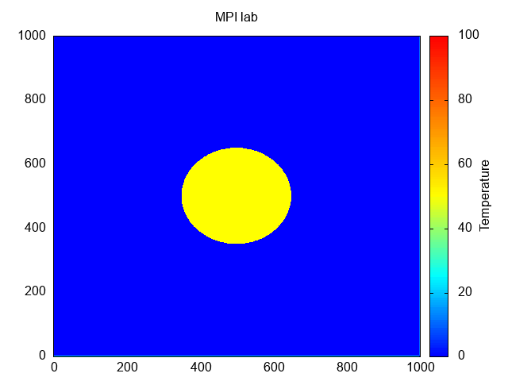

# Lab 7: Solving a two-dimensional thermal conductivity problem using MPI

## Team

 - [Maksym Protsyk](https://github.com/maksprotsyk)
 - [Bogdan Sydor](https://github.com/sydorbogdan)
 - [Yarema Mischenko](https://github.com/RavenbornJB)

## Usage

### Build
```bash
mkdir build
cd build
cmake ..
make
```

### Run
```bash
mpirun -np "number" --oversubscribe --verbose  ./bin/MPI_lab  "config_filename"
```

-np parameter should be >= 2 (because processing thread and io thread should run on separate processes);


### Generate heatmap
Set parameters of heatmap and then
```bash
python3 generate_heatmap.py
```

### Generate gif
Set input and output and then
```bash
gnuplot script.gp
```


## Prerequisites

 - **C++ compiler** - needs to support **C++17** standard
 - **CMake** 3.15+
 - **MPI** installed
 - **Boost** installed
 
Dependencies (such as development libraries) can be found in the [dependencies folder](./dependencies) in the form of the text files with package names for different package managers.


## Results 


Parameters:
 - dx=0.01
 - dy=0.01
 - dt=0.001
 - alpha=0.01
 - iterations=40000
 - iter_per_save=1000

That means we saved one frame every second (however gif is running a little bit faster
due to the parameters we set in gnuplot script)